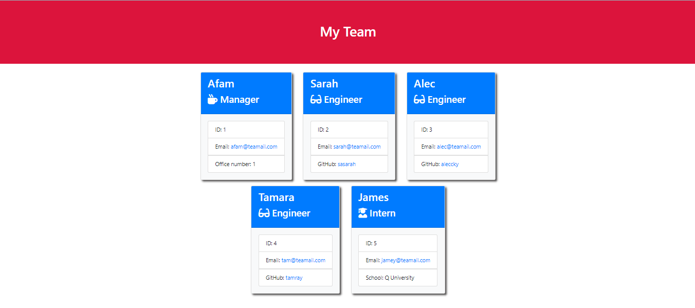

# Team-Profile-Generator

## Description

Team Profile Generator is a command-line application that generates a team profile HTML file based on user input. This project implements object-oriented programming principles (OOP), uses prompts to collect information about team members and generates an HTML file based on the collected information. This project uses Node.js, Inquirer.js, and Jest. The generated HTML file is styled using Bootstrap and custom CSS.

## Installation

Clone this repository to your local machine and then run `npm install` in the terminal to install the required dependencies.

## Usage

In the terminal, run the command `node index.js` to start the application.
Enter inputs when prompted with questions that will ask for the content of the HTML file. The generated `team.html` will be written to the `output` folder.

## Screenshots

**Sample HTML**
[Sample HTML](https://github.com/obeeyoma/Team-Profile-Generator/blob/main/output/team.html)
